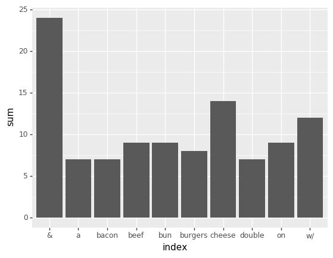
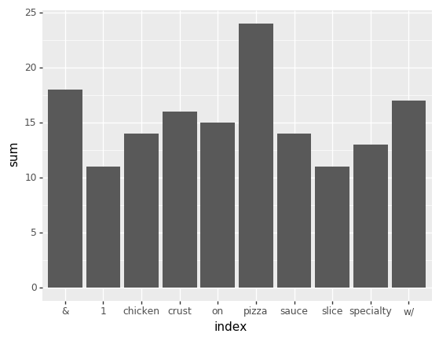
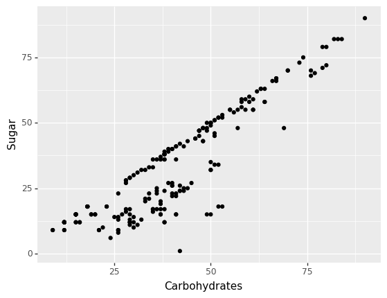
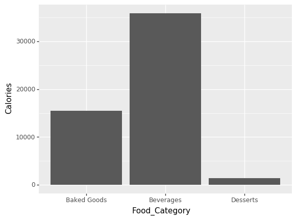
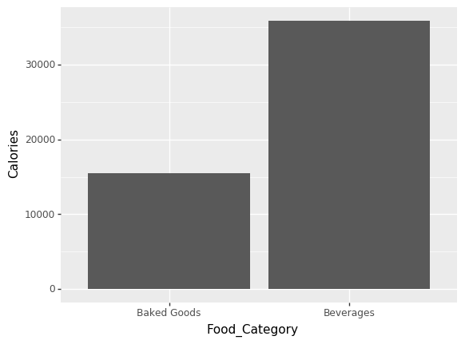
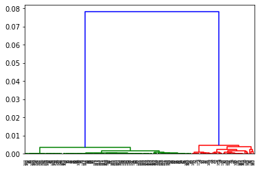

# Project 2

**this is not a group project**

This project will focus on comparing and contrasting the supervised and unsupervised algorithms we have learned so far. **Clearly label each section and number in the notebook**


## Part I

Use the dataset *burgersOrPizza.csv* to build 3 models that predict whether a food is a burger or pizza (you can use any of the predictive models we've learned).

For each model:

0. Explore data (with ggplot)
1. Explain which variables you're using to predict the outcome. 
2. Explain which model validation technique you're using and why. 
3. Explain why you did or did not choose to standardize your continuous variables.
4. Evaluate how the model performed. Explain.

At the end:

5. Compare the performance of the 3 models using the accuracy, and the confusion matrix (consider things like how many it got correct, which errors it w


```python
#https://docs.bamboolib.8080labs.com/documentation/how-tos/installation-and-setup/install-bamboolib
#https://docs.bamboolib.8080labs.com/documentation/how-tos/installation-and-setup/install-bamboolib/test-bamboolib
#https://stackoverflow.com/questions/19913659/pandas-conditional-creation-of-a-series-dataframe-column

import yaml
#import bamboolib as bam
import pandas as pd
import numpy as np
import warnings
from plotnine import *
#import matplotlib as plt
warnings.filterwarnings('ignore')

from sklearn.preprocessing import StandardScaler #Z-score variables
from sklearn.preprocessing import LabelEncoder 

from sklearn.cluster import AgglomerativeClustering, KMeans
from sklearn.mixture import GaussianMixture
from sklearn.metrics import silhouette_score
import scipy.cluster.hierarchy as sch

from sklearn.model_selection import train_test_split # simple TT split cv
from sklearn.linear_model import LogisticRegression # Logistic Regression Model
from sklearn.tree import DecisionTreeClassifier # Decision Tree
from sklearn.naive_bayes import GaussianNB
from sklearn.metrics import accuracy_score, precision_score, recall_score, confusion_matrix, roc_curve,roc_auc_score #model eval

%matplotlib inline
#plt.rcParams['figure.figsize'] = (8,25)
pd.options.display.max_columns = None
pd.set_option('display.max_rows', 500)
```


```python
foods = pd.read_csv('data/burgersOrPizza.csv')
foods.head()
```


<div>
<style scoped>
    .dataframe tbody tr th:only-of-type {
        vertical-align: middle;
    }

    .dataframe tbody tr th {
        vertical-align: top;
    }

    .dataframe thead th {
        text-align: right;
    }
</style>
<table border="1" class="dataframe">
  <thead>
    <tr style="text-align: right;">
      <th></th>
      <th>Item_Name</th>
      <th>Item_Description</th>
      <th>Food_Category</th>
      <th>Calories</th>
      <th>Total_Fat</th>
      <th>Saturated_Fat</th>
      <th>Trans_Fat</th>
      <th>Cholesterol</th>
      <th>Sodium</th>
      <th>Potassium</th>
      <th>Carbohydrates</th>
      <th>Protein</th>
      <th>Sugar</th>
      <th>Dietary_Fiber</th>
      <th>Calories_100g</th>
      <th>Total_Fat_100g</th>
      <th>Saturated_Fat_100g</th>
      <th>Trans_Fat_100g</th>
      <th>Cholesterol_100g</th>
      <th>Sodium_100g</th>
      <th>Potassium_100g</th>
      <th>Carbohydrates_100g</th>
      <th>Protein_100g</th>
      <th>Sugar_100g</th>
      <th>Dietary_Fiber_100g</th>
    </tr>
  </thead>
  <tbody>
    <tr>
      <td>0</td>
      <td>Chicken n Cheese Slider</td>
      <td>Chicken n Cheese Slider on Mini Bun w/ Chicken...</td>
      <td>Burgers</td>
      <td>290.0</td>
      <td>12.0</td>
      <td>3.5</td>
      <td>0.0</td>
      <td>25.0</td>
      <td>720.0</td>
      <td>NaN</td>
      <td>30.0</td>
      <td>15.0</td>
      <td>1.0</td>
      <td>1.0</td>
      <td>293</td>
      <td>12</td>
      <td>4</td>
      <td>0.0</td>
      <td>25</td>
      <td>727</td>
      <td>NaN</td>
      <td>30</td>
      <td>15</td>
      <td>1.0</td>
      <td>1.0</td>
    </tr>
    <tr>
      <td>1</td>
      <td>Corned Beef n Cheese Slider</td>
      <td>Corned Beef n Cheese Slider on Mini Bun w/ Cor...</td>
      <td>Burgers</td>
      <td>220.0</td>
      <td>9.0</td>
      <td>3.5</td>
      <td>0.0</td>
      <td>30.0</td>
      <td>890.0</td>
      <td>NaN</td>
      <td>21.0</td>
      <td>14.0</td>
      <td>1.0</td>
      <td>1.0</td>
      <td>242</td>
      <td>10</td>
      <td>4</td>
      <td>0.0</td>
      <td>33</td>
      <td>978</td>
      <td>NaN</td>
      <td>23</td>
      <td>15</td>
      <td>1.0</td>
      <td>1.0</td>
    </tr>
    <tr>
      <td>2</td>
      <td>Ham n Cheese Slider</td>
      <td>Ham n Cheese Slider on Mini Bun w/ Roast Ham &amp;...</td>
      <td>Burgers</td>
      <td>230.0</td>
      <td>9.0</td>
      <td>3.5</td>
      <td>0.0</td>
      <td>30.0</td>
      <td>750.0</td>
      <td>NaN</td>
      <td>22.0</td>
      <td>13.0</td>
      <td>3.0</td>
      <td>1.0</td>
      <td>253</td>
      <td>10</td>
      <td>4</td>
      <td>0.0</td>
      <td>33</td>
      <td>824</td>
      <td>NaN</td>
      <td>24</td>
      <td>14</td>
      <td>3.0</td>
      <td>1.0</td>
    </tr>
    <tr>
      <td>3</td>
      <td>Jalapeno Roast Beef n Cheese Slider</td>
      <td>Jalapeno Roast Beef n Cheese Slider on Mini Bu...</td>
      <td>Burgers</td>
      <td>240.0</td>
      <td>11.0</td>
      <td>4.5</td>
      <td>0.0</td>
      <td>30.0</td>
      <td>670.0</td>
      <td>NaN</td>
      <td>21.0</td>
      <td>14.0</td>
      <td>1.0</td>
      <td>1.0</td>
      <td>245</td>
      <td>11</td>
      <td>5</td>
      <td>0.0</td>
      <td>31</td>
      <td>684</td>
      <td>NaN</td>
      <td>21</td>
      <td>14</td>
      <td>1.0</td>
      <td>1.0</td>
    </tr>
    <tr>
      <td>4</td>
      <td>Roast Beef n Cheese Slider</td>
      <td>Roast Beef n Cheese Slider on Mini Bun w/ Roas...</td>
      <td>Burgers</td>
      <td>240.0</td>
      <td>11.0</td>
      <td>4.5</td>
      <td>0.0</td>
      <td>30.0</td>
      <td>670.0</td>
      <td>NaN</td>
      <td>21.0</td>
      <td>14.0</td>
      <td>1.0</td>
      <td>1.0</td>
      <td>264</td>
      <td>12</td>
      <td>5</td>
      <td>0.0</td>
      <td>33</td>
      <td>736</td>
      <td>NaN</td>
      <td>23</td>
      <td>15</td>
      <td>1.0</td>
      <td>1.0</td>
    </tr>
  </tbody>
</table>
</div>


```python
foods_string = foods.select_dtypes('object')
```


```python
conditions = [(foods_string['Food_Category'] == 'Burgers'),
              (foods_string['Food_Category'] == 'Pizza'),
             ((foods_string['Food_Category'] != 'Pizza').all() or (foods_string['Food_Category'] !='Burgers').all())]
choices = [0,1,2]

foods_string['binary'] = np.select(conditions, choices, default=2)
```


```python
foods_string['Item_Description'].replace(',','', regex=True, inplace=True)
foods_string['Item_Description'] = foods_string['Item_Description'].str.lower()
```


```python
burger = foods_string[foods_string['binary'] == 0]
words = burger.Item_Description.sample(n = 20).head(20).apply(lambda x: pd.value_counts(x.split(" "))).sum(axis = 0).sort_values(ascending=[False])
words = pd.DataFrame(words, columns=['sum'])
words.reset_index(inplace=True)
```


```python
(ggplot(words.head(10),aes(x = 'index', y= 'sum'))+geom_bar(stat='identity'))
```





    <ggplot: (-9223371872393059668)>


```python
pizza = foods_string[foods_string['binary'] == 1]
words = pizza.Item_Description.sample(n = 20).head(20).apply(lambda x: pd.value_counts(x.split(" "))).sum(axis = 0).sort_values(ascending=[False])
words = pd.DataFrame(words, columns=['sum'])
words.reset_index(inplace=True)
```


```python
(ggplot(words.head(10),aes(x = 'index', y= 'sum'))+geom_bar(stat='identity'))
```





    <ggplot: (-9223371872392812664)>


```python
with open("data/words.yaml") as file:
        words = yaml.load(file, Loader=yaml.FullLoader)

pizza = words['pizza']
burger = words['burger']
```


```python
foods_string['pizza_words'] = np.nan
foods_string['burger_words'] = np.nan
```


```python
for i in range(0,len(foods_string.Item_Description)):
    burger_freq = []
    pizza_freq = []
    for w in foods_string.Item_Description[i].split(" "):
        burger_freq.append(burger.count(w))
        pizza_freq.append(pizza.count(w))
    
    
    foods_string.burger_words.loc[i] = sum(burger_freq)
    foods_string.pizza_words.loc[i] = sum(pizza_freq)
```


```python
foods_string.sample(n = 15).head(15)
```


<div>
<style scoped>
    .dataframe tbody tr th:only-of-type {
        vertical-align: middle;
    }

    .dataframe tbody tr th {
        vertical-align: top;
    }

    .dataframe thead th {
        text-align: right;
    }
</style>
<table border="1" class="dataframe">
  <thead>
    <tr style="text-align: right;">
      <th></th>
      <th>Item_Name</th>
      <th>Item_Description</th>
      <th>Food_Category</th>
      <th>binary</th>
      <th>pizza_words</th>
      <th>burger_words</th>
    </tr>
  </thead>
  <tbody>
    <tr>
      <td>173</td>
      <td>Honolulu Hawaiian on Gluten Free Crust, Small</td>
      <td>honolulu hawaiian on gluten free crust w/ robu...</td>
      <td>Pizza</td>
      <td>1</td>
      <td>6.0</td>
      <td>1.0</td>
    </tr>
    <tr>
      <td>895</td>
      <td>Breakfast Slider w/ Hamburger, Egg &amp; Cheese</td>
      <td>breakfast slider w/ hamburger egg &amp; cheese bre...</td>
      <td>Burgers</td>
      <td>0</td>
      <td>0.0</td>
      <td>1.0</td>
    </tr>
    <tr>
      <td>456</td>
      <td>Tropical Luau Pizza, Original Crust, Pizza For...</td>
      <td>tropical luau pizza on original crust w/ julie...</td>
      <td>Pizza</td>
      <td>1</td>
      <td>4.0</td>
      <td>0.0</td>
    </tr>
    <tr>
      <td>857</td>
      <td>Avocado Bacon Burger Whatameal</td>
      <td>avocado bacon burger whatameal on texas toast ...</td>
      <td>Burgers</td>
      <td>0</td>
      <td>1.0</td>
      <td>3.0</td>
    </tr>
    <tr>
      <td>477</td>
      <td>BBQ Chicken Bacon Pizza, Pan Crust</td>
      <td>bbq chicken bacon pizza on pan crust w/ zesty ...</td>
      <td>Pizza</td>
      <td>1</td>
      <td>4.0</td>
      <td>0.0</td>
    </tr>
    <tr>
      <td>13</td>
      <td>Whopper Sandwich w/ Cheese &amp; Mayo</td>
      <td>whopper sandwich w/ cheese &amp; mayo whopper sand...</td>
      <td>Burgers</td>
      <td>0</td>
      <td>0.0</td>
      <td>0.0</td>
    </tr>
    <tr>
      <td>542</td>
      <td>Guinevere's Garden Delight on Original Crust, ...</td>
      <td>guinevere's garden delight on original crust w...</td>
      <td>Pizza</td>
      <td>1</td>
      <td>4.0</td>
      <td>0.0</td>
    </tr>
    <tr>
      <td>827</td>
      <td>Green Chile Double Jr</td>
      <td>green chile double jr on small white toasted b...</td>
      <td>Burgers</td>
      <td>0</td>
      <td>0.0</td>
      <td>5.0</td>
    </tr>
    <tr>
      <td>189</td>
      <td>Ultimate Pepperoni on Gluten Free Crust, Small</td>
      <td>ultimate pepperoni on gluten free crust w/ rob...</td>
      <td>Pizza</td>
      <td>1</td>
      <td>7.0</td>
      <td>1.0</td>
    </tr>
    <tr>
      <td>467</td>
      <td>Chicken &amp; Veggie Pizza, Pan Crust, 1 Slice</td>
      <td>chicken &amp; veggie pizza on pan crust w/ grilled...</td>
      <td>Pizza</td>
      <td>1</td>
      <td>5.0</td>
      <td>0.0</td>
    </tr>
    <tr>
      <td>180</td>
      <td>Philly Cheese Steak Pizza on Handmade Pan Crus...</td>
      <td>philly cheese steak pizza on handmade pan crus...</td>
      <td>Pizza</td>
      <td>1</td>
      <td>4.0</td>
      <td>1.0</td>
    </tr>
    <tr>
      <td>312</td>
      <td>Stacked Grilled Cheese Burger Munchie Meal</td>
      <td>stacked grilled cheese burger munchie meal on ...</td>
      <td>Burgers</td>
      <td>0</td>
      <td>0.0</td>
      <td>0.0</td>
    </tr>
    <tr>
      <td>373</td>
      <td>Tuscan Six Cheese Pizza, Original Crust, Large...</td>
      <td>tuscan six cheese pizza on original crust w/ p...</td>
      <td>Pizza</td>
      <td>1</td>
      <td>3.0</td>
      <td>0.0</td>
    </tr>
    <tr>
      <td>690</td>
      <td>Pepperoni on Pan Crust, Large</td>
      <td>pepperoni on pan crust large pizzas</td>
      <td>Pizza</td>
      <td>1</td>
      <td>3.0</td>
      <td>0.0</td>
    </tr>
    <tr>
      <td>272</td>
      <td>Hamburger Meal, Kids</td>
      <td>hamburger meal kids thickburgers &amp; sandwiches</td>
      <td>Burgers</td>
      <td>0</td>
      <td>0.0</td>
      <td>0.0</td>
    </tr>
  </tbody>
</table>
</div>


### Logistic Regression

I am using the created common words count variables as the predictor variables because the decription of the food is much more telling of what a food is than any nutitional information. Also if the data is there, might as well use it. I used a traditional train test split for this model because it is the easiest to implement and think other methods are overkill in this situation. I did not standardize any variables because both variables are on the same scale. The model did very well given the accuracy score of .94 meaning that the model correctly classified 94% of the data. False positives rate was also very high meaning that the outcome predicted is trustable and precise such that that 99% of the times the model predicts a positive (pizza) outcome it is correct. Sensitivity score is fairly high (93%) suggesting that the model will falsly classify 7% of pizzas as burgers.


```python
predictors = {'pizza_words','burger_words'}
X_train, X_test, y_train, y_test = train_test_split(foods_string[predictors], foods_string["binary"], test_size=0.4)
```


```python
model = LogisticRegression()
model.fit(X_train, y_train)

train_pred = model.predict(X_train)
test_pred = model.predict(X_test)
```


```python
foods_string.reset_index(inplace=True)
test_copy = X_test.copy()
test_copy.reset_index(inplace=True)

test_copy = pd.merge(test_copy, foods_string[['index','Item_Description','binary']], on='index', how='left')
test_copy['log_preds'] = test_pred
```


```python
print("Accuracy - TP+TN/TP+FP+FN+TN:",accuracy_score(y_test, test_pred))
print("Precision - TP/TP+FP:",precision_score(y_test, test_pred)) #relates to low false positivity
print("Recall/Sensitivity/TPR - TP/TP+FN:",recall_score(y_test, test_pred))
```

    Accuracy - TP+TN/TP+FP+FN+TN: 0.9407008086253369
    Precision - TP/TP+FP: 0.9877551020408163
    Recall/Sensitivity/TPR - TP/TP+FN: 0.9272030651340997
    

### Decision Tree

I am using the created common words count variables as the predictor variables because the decription of the food is much more telling of what a food is than any nutitional information. Also if the data is there, might as well use it. I used a traditional train test split for this model because it is the easiest to implement and think other methods are overkill in this situation. I did not standardize any variables because both variables are on the same scale. The model did very well given the accuracy score of .92 meaning that the model correctly classified 92% of the data. False positives rate was also high meaning that the outcome predicted is trustable and precise such that that 89% of the times the model predicts a positive (pizza) outcome it is correct. Sensitivity score is suspiciously high (100%) suggesting that the model will default to pizza.


```python
tree = DecisionTreeClassifier()
tree.fit(X_train, y_train)

y_pred = tree.predict(X_test)
```


```python
test_copy['dt_preds'] = y_pred
```


```python
print("Accuracy - TP+TN/TP+FP+FN+TN:",accuracy_score(y_test, y_pred))
print("Precision - TP/TP+FP:",precision_score(y_test, y_pred)) #relates to low false positivity
print("Recall/Sensitivity/TPR - TP/TP+FN:",recall_score(y_test, y_pred))
```

    Accuracy - TP+TN/TP+FP+FN+TN: 0.954177897574124
    Precision - TP/TP+FP: 1.0
    Recall/Sensitivity/TPR - TP/TP+FN: 0.9348659003831418
    

### Naive-Bayes

I am using the created common words count variables as the predictor variables because the decription of the food is much more telling of what a food is than any nutitional information. Also if the data is there, might as well use it. I used a traditional train test split for this model because it is the easiest to implement and think other methods are overkill in this situation. I did not standardize any variables because both variables are on the same scale. The model did very well given the accuracy score of .91 meaning that the model correctly classified 91% of the data. False positives rate was also high meaning that the outcome predicted is trustable and precise such that that 90% of the times the model predicts a positive (pizza) outcome it is correct. Sensitivity score is suspiciously high (99%) suggesting that the model will most likely default to pizza.


```python
nb = GaussianNB()

nb.fit(X_train,y_train)

y_pred = nb.predict(X_test)
```


```python
test_copy['nb_preds'] = y_pred
```


```python
print("Accuracy - TP+TN/TP+FP+FN+TN:",accuracy_score(y_test, y_pred))
print("Precision - TP/TP+FP:",precision_score(y_test, y_pred)) #relates to low false positivity
print("Recall/Sensitivity/TPR - TP/TP+FN:",recall_score(y_test, y_pred))
```

    Accuracy - TP+TN/TP+FP+FN+TN: 0.9487870619946092
    Precision - TP/TP+FP: 0.9416058394160584
    Recall/Sensitivity/TPR - TP/TP+FN: 0.9885057471264368
    

### Comparison


Looking at all the models performances in accuracy, you can clearly see the small differences in each model. Both the logistic and decision tree models have high true positives as indicated in the accuracy score as well as 0 false positives. However it is interesting to note that the naive bayes model has a significantly lower false positives meaning that this model is bias and is likely to predict pizza more than burger. In a case where outcome is more important to predict a positive, it might be better to use this model, but since were predicting pizza and burgers id say this is the worse models. Differences in the models can also be seen actually inspecting the output and it is clear that the models have a tough time when word counts are equal. This can be easily solved by adding more descriptive words in the ingredient list such as mayo and triple since these words are more used in describing burgers than pizza.


```python
cnf_matrix = confusion_matrix(test_copy['binary'], test_copy['log_preds'])
cnf_matrix
```


    array([[107,   3],
           [ 19, 242]], dtype=int64)


```python
cnf_matrix = confusion_matrix(test_copy['binary'], test_copy['dt_preds'])
cnf_matrix
```


    array([[110,   0],
           [ 17, 244]], dtype=int64)


```python
cnf_matrix = confusion_matrix(test_copy['binary'], test_copy['nb_preds'])
cnf_matrix
```


    array([[ 94,  16],
           [  3, 258]], dtype=int64)


```python
test_copy[(test_copy['binary'] != test_copy['log_preds']).all() or 
          (test_copy['binary'] != test_copy['dt_preds']).all() or
          (test_copy['binary'] != test_copy['nb_preds'])]
```


<div>
<style scoped>
    .dataframe tbody tr th:only-of-type {
        vertical-align: middle;
    }

    .dataframe tbody tr th {
        vertical-align: top;
    }

    .dataframe thead th {
        text-align: right;
    }
</style>
<table border="1" class="dataframe">
  <thead>
    <tr style="text-align: right;">
      <th></th>
      <th>index</th>
      <th>burger_words</th>
      <th>pizza_words</th>
      <th>Item_Description</th>
      <th>binary</th>
      <th>log_preds</th>
      <th>dt_preds</th>
      <th>nb_preds</th>
    </tr>
  </thead>
  <tbody>
    <tr>
      <td>1</td>
      <td>254</td>
      <td>0.0</td>
      <td>0.0</td>
      <td>little cheeseburger little burgers</td>
      <td>0</td>
      <td>0</td>
      <td>0</td>
      <td>1</td>
    </tr>
    <tr>
      <td>24</td>
      <td>283</td>
      <td>0.0</td>
      <td>0.0</td>
      <td>1/2 lb frisco thickburger thickburgers &amp; sandw...</td>
      <td>0</td>
      <td>0</td>
      <td>0</td>
      <td>1</td>
    </tr>
    <tr>
      <td>32</td>
      <td>454</td>
      <td>2.0</td>
      <td>2.0</td>
      <td>the big bonanza on original crust w/ bbq sauce...</td>
      <td>1</td>
      <td>0</td>
      <td>1</td>
      <td>0</td>
    </tr>
    <tr>
      <td>53</td>
      <td>256</td>
      <td>0.0</td>
      <td>0.0</td>
      <td>little bacon cheeseburger</td>
      <td>0</td>
      <td>0</td>
      <td>0</td>
      <td>1</td>
    </tr>
    <tr>
      <td>55</td>
      <td>272</td>
      <td>0.0</td>
      <td>0.0</td>
      <td>hamburger meal kids thickburgers &amp; sandwiches</td>
      <td>0</td>
      <td>0</td>
      <td>0</td>
      <td>1</td>
    </tr>
    <tr>
      <td>88</td>
      <td>327</td>
      <td>0.0</td>
      <td>0.0</td>
      <td>bbq bacon &amp; cheese ba lunch &amp; dinner</td>
      <td>0</td>
      <td>0</td>
      <td>0</td>
      <td>1</td>
    </tr>
    <tr>
      <td>113</td>
      <td>81</td>
      <td>0.0</td>
      <td>0.0</td>
      <td>cheddar butterburger w/ bacon single butterbur...</td>
      <td>0</td>
      <td>0</td>
      <td>0</td>
      <td>1</td>
    </tr>
    <tr>
      <td>128</td>
      <td>76</td>
      <td>0.0</td>
      <td>0.0</td>
      <td>butterburger the original butterburgers kids m...</td>
      <td>0</td>
      <td>0</td>
      <td>0</td>
      <td>1</td>
    </tr>
    <tr>
      <td>142</td>
      <td>301</td>
      <td>0.0</td>
      <td>0.0</td>
      <td>hamburger burgers &amp; more kids &amp; adults menu</td>
      <td>0</td>
      <td>0</td>
      <td>0</td>
      <td>1</td>
    </tr>
    <tr>
      <td>198</td>
      <td>79</td>
      <td>0.0</td>
      <td>0.0</td>
      <td>butterburger cheese triple butterburgers</td>
      <td>0</td>
      <td>0</td>
      <td>0</td>
      <td>1</td>
    </tr>
    <tr>
      <td>199</td>
      <td>452</td>
      <td>2.0</td>
      <td>2.0</td>
      <td>the big bonanza on original crust w/ bbq sauce...</td>
      <td>1</td>
      <td>0</td>
      <td>1</td>
      <td>0</td>
    </tr>
    <tr>
      <td>209</td>
      <td>255</td>
      <td>0.0</td>
      <td>0.0</td>
      <td>little bacon burger</td>
      <td>0</td>
      <td>0</td>
      <td>0</td>
      <td>1</td>
    </tr>
    <tr>
      <td>240</td>
      <td>329</td>
      <td>0.0</td>
      <td>0.0</td>
      <td>chili cheese krystal lunch &amp; dinner</td>
      <td>0</td>
      <td>0</td>
      <td>0</td>
      <td>1</td>
    </tr>
    <tr>
      <td>249</td>
      <td>18</td>
      <td>0.0</td>
      <td>0.0</td>
      <td>bk veggie burger w/out mayo chicken &amp; more</td>
      <td>0</td>
      <td>0</td>
      <td>0</td>
      <td>1</td>
    </tr>
    <tr>
      <td>291</td>
      <td>698</td>
      <td>1.0</td>
      <td>1.0</td>
      <td>tomato pesto flatbreads artisan flatbread full...</td>
      <td>1</td>
      <td>0</td>
      <td>0</td>
      <td>0</td>
    </tr>
    <tr>
      <td>324</td>
      <td>22</td>
      <td>0.0</td>
      <td>0.0</td>
      <td>whopper sandwich w/ cheese w/out mayo whopper ...</td>
      <td>0</td>
      <td>0</td>
      <td>0</td>
      <td>1</td>
    </tr>
    <tr>
      <td>327</td>
      <td>85</td>
      <td>0.0</td>
      <td>0.0</td>
      <td>cheddar butterburger butterburgers triple</td>
      <td>0</td>
      <td>0</td>
      <td>0</td>
      <td>1</td>
    </tr>
    <tr>
      <td>355</td>
      <td>84</td>
      <td>0.0</td>
      <td>0.0</td>
      <td>cheddar butterburger single butterburgers; cho...</td>
      <td>0</td>
      <td>0</td>
      <td>0</td>
      <td>1</td>
    </tr>
    <tr>
      <td>367</td>
      <td>313</td>
      <td>0.0</td>
      <td>0.0</td>
      <td>hella peno burger munchie meal w/ 20 fl oz coc...</td>
      <td>0</td>
      <td>0</td>
      <td>0</td>
      <td>1</td>
    </tr>
  </tbody>
</table>
</div>


## Part II

Use the dataset *KrispyKreme.csv* to build 2 clustering models (you can use any of the clustering models we've learned). 

For each model:

0. Explore data (with ggplot)
1. Explain which variables you're using to predict the outcome. 
2. Evaluate how the model performed using sihouette scores. Look at different numbers of cluseters (like k = 3,5..etc). Which number of clusters is the best fit?
3. Describe the clusters (what are they like? how are they different)

At the end: 

4. Compare the clusters obtained by the two models. Overall are they similar? or really different (i.e. do they contain mostly the same members?)


**Please get rid of extra analyses/superfluous code before turning it in**. Turn in A PDF on Blackboard.


```python
donuts = pd.read_csv('data/KrispyKreme.csv')
donuts.head(10)
```


<div>
<style scoped>
    .dataframe tbody tr th:only-of-type {
        vertical-align: middle;
    }

    .dataframe tbody tr th {
        vertical-align: top;
    }

    .dataframe thead th {
        text-align: right;
    }
</style>
<table border="1" class="dataframe">
  <thead>
    <tr style="text-align: right;">
      <th></th>
      <th>Restaurant_Item_Name</th>
      <th>restaurant</th>
      <th>Restaurant_ID</th>
      <th>Item_Name</th>
      <th>Item_Description</th>
      <th>Food_Category</th>
      <th>Serving_Size</th>
      <th>Serving_Size_text</th>
      <th>Serving_Size_Unit</th>
      <th>Serving_Size_household</th>
      <th>Calories</th>
      <th>Total_Fat</th>
      <th>Saturated_Fat</th>
      <th>Trans_Fat</th>
      <th>Cholesterol</th>
      <th>Sodium</th>
      <th>Potassium</th>
      <th>Carbohydrates</th>
      <th>Protein</th>
      <th>Sugar</th>
      <th>Dietary_Fiber</th>
      <th>Calories_100g</th>
      <th>Total_Fat_100g</th>
      <th>Saturated_Fat_100g</th>
      <th>Trans_Fat_100g</th>
      <th>Cholesterol_100g</th>
      <th>Sodium_100g</th>
      <th>Potassium_100g</th>
      <th>Carbohydrates_100g</th>
      <th>Protein_100g</th>
      <th>Sugar_100g</th>
      <th>Dietary_Fiber_100g</th>
    </tr>
  </thead>
  <tbody>
    <tr>
      <td>0</td>
      <td>Krispy Kreme Apple Fritter</td>
      <td>Krispy Kreme</td>
      <td>49</td>
      <td>Apple Fritter</td>
      <td>Apple Fritter, Doughnuts</td>
      <td>Baked Goods</td>
      <td>100</td>
      <td>NaN</td>
      <td>g</td>
      <td>NaN</td>
      <td>350</td>
      <td>19.0</td>
      <td>9.0</td>
      <td>0.0</td>
      <td>0</td>
      <td>110</td>
      <td>45.0</td>
      <td>42</td>
      <td>4</td>
      <td>26</td>
      <td>1.0</td>
      <td>350</td>
      <td>19</td>
      <td>9</td>
      <td>0</td>
      <td>0</td>
      <td>110</td>
      <td>45.0</td>
      <td>42</td>
      <td>4</td>
      <td>26</td>
      <td>1.0</td>
    </tr>
    <tr>
      <td>1</td>
      <td>Krispy Kreme Chocolate Iced Cake Doughnut</td>
      <td>Krispy Kreme</td>
      <td>49</td>
      <td>Chocolate Iced Cake Doughnut</td>
      <td>Chocolate Iced Cake Doughnut, Doughnuts</td>
      <td>Baked Goods</td>
      <td>71</td>
      <td>NaN</td>
      <td>g</td>
      <td>NaN</td>
      <td>280</td>
      <td>13.0</td>
      <td>5.0</td>
      <td>0.0</td>
      <td>25</td>
      <td>310</td>
      <td>35.0</td>
      <td>37</td>
      <td>3</td>
      <td>19</td>
      <td>NaN</td>
      <td>394</td>
      <td>18</td>
      <td>7</td>
      <td>0</td>
      <td>35</td>
      <td>437</td>
      <td>49.0</td>
      <td>52</td>
      <td>4</td>
      <td>27</td>
      <td>NaN</td>
    </tr>
    <tr>
      <td>2</td>
      <td>Krispy Kreme Chocolate Iced Custard Filled Dou...</td>
      <td>Krispy Kreme</td>
      <td>49</td>
      <td>Chocolate Iced Custard Filled Doughnut</td>
      <td>Chocolate Iced Custard Filled Doughnut, Doughnuts</td>
      <td>Baked Goods</td>
      <td>85</td>
      <td>NaN</td>
      <td>g</td>
      <td>NaN</td>
      <td>300</td>
      <td>15.0</td>
      <td>7.0</td>
      <td>0.0</td>
      <td>0</td>
      <td>140</td>
      <td>50.0</td>
      <td>37</td>
      <td>4</td>
      <td>17</td>
      <td>1.0</td>
      <td>353</td>
      <td>18</td>
      <td>8</td>
      <td>0</td>
      <td>0</td>
      <td>165</td>
      <td>59.0</td>
      <td>44</td>
      <td>5</td>
      <td>20</td>
      <td>1.0</td>
    </tr>
    <tr>
      <td>3</td>
      <td>Krispy Kreme Chocolate Iced Glazed Doughnut</td>
      <td>Krispy Kreme</td>
      <td>49</td>
      <td>Chocolate Iced Glazed Doughnut</td>
      <td>Chocolate Iced Glazed Doughnut, Doughnuts</td>
      <td>Baked Goods</td>
      <td>63</td>
      <td>NaN</td>
      <td>g</td>
      <td>NaN</td>
      <td>240</td>
      <td>11.0</td>
      <td>5.0</td>
      <td>0.0</td>
      <td>0</td>
      <td>90</td>
      <td>35.0</td>
      <td>33</td>
      <td>3</td>
      <td>20</td>
      <td>NaN</td>
      <td>381</td>
      <td>17</td>
      <td>8</td>
      <td>0</td>
      <td>0</td>
      <td>143</td>
      <td>56.0</td>
      <td>52</td>
      <td>5</td>
      <td>32</td>
      <td>NaN</td>
    </tr>
    <tr>
      <td>4</td>
      <td>Krispy Kreme Chocolate Iced Glazed Cruller Dou...</td>
      <td>Krispy Kreme</td>
      <td>49</td>
      <td>Chocolate Iced Glazed Cruller Doughnut</td>
      <td>Chocolate Iced Glazed Cruller Doughnut, Doughnuts</td>
      <td>Baked Goods</td>
      <td>70</td>
      <td>NaN</td>
      <td>g</td>
      <td>NaN</td>
      <td>260</td>
      <td>10.0</td>
      <td>4.0</td>
      <td>0.0</td>
      <td>20</td>
      <td>270</td>
      <td>20.0</td>
      <td>40</td>
      <td>3</td>
      <td>26</td>
      <td>NaN</td>
      <td>371</td>
      <td>14</td>
      <td>6</td>
      <td>0</td>
      <td>29</td>
      <td>386</td>
      <td>29.0</td>
      <td>57</td>
      <td>4</td>
      <td>37</td>
      <td>NaN</td>
    </tr>
    <tr>
      <td>5</td>
      <td>Krispy Kreme Football Doughnut</td>
      <td>Krispy Kreme</td>
      <td>49</td>
      <td>Football Doughnut</td>
      <td>Football Doughnut, Doughnuts</td>
      <td>Baked Goods</td>
      <td>71</td>
      <td>NaN</td>
      <td>g</td>
      <td>NaN</td>
      <td>310</td>
      <td>16.0</td>
      <td>7.0</td>
      <td>0.0</td>
      <td>0</td>
      <td>140</td>
      <td>NaN</td>
      <td>35</td>
      <td>7</td>
      <td>16</td>
      <td>3.0</td>
      <td>437</td>
      <td>23</td>
      <td>10</td>
      <td>0</td>
      <td>0</td>
      <td>197</td>
      <td>NaN</td>
      <td>49</td>
      <td>10</td>
      <td>23</td>
      <td>4.0</td>
    </tr>
    <tr>
      <td>6</td>
      <td>Krispy Kreme Chocolate Iced w/ Kreme Filling</td>
      <td>Krispy Kreme</td>
      <td>49</td>
      <td>Chocolate Iced w/ Kreme Filling</td>
      <td>Chocolate Iced w/ Kreme Filling, Doughnuts</td>
      <td>Baked Goods</td>
      <td>85</td>
      <td>NaN</td>
      <td>g</td>
      <td>NaN</td>
      <td>350</td>
      <td>19.0</td>
      <td>9.0</td>
      <td>0.0</td>
      <td>0</td>
      <td>140</td>
      <td>50.0</td>
      <td>41</td>
      <td>4</td>
      <td>23</td>
      <td>1.0</td>
      <td>412</td>
      <td>22</td>
      <td>11</td>
      <td>0</td>
      <td>0</td>
      <td>165</td>
      <td>59.0</td>
      <td>48</td>
      <td>5</td>
      <td>27</td>
      <td>1.0</td>
    </tr>
    <tr>
      <td>7</td>
      <td>Krispy Kreme Chocolate Iced Glazed Doughnut w/...</td>
      <td>Krispy Kreme</td>
      <td>49</td>
      <td>Chocolate Iced Glazed Doughnut w/ Rainbow Spri...</td>
      <td>Chocolate Iced Glazed Doughnut w/ Rainbow Spri...</td>
      <td>Baked Goods</td>
      <td>66</td>
      <td>NaN</td>
      <td>g</td>
      <td>NaN</td>
      <td>250</td>
      <td>11.0</td>
      <td>5.0</td>
      <td>0.0</td>
      <td>0</td>
      <td>90</td>
      <td>35.0</td>
      <td>36</td>
      <td>3</td>
      <td>23</td>
      <td>NaN</td>
      <td>379</td>
      <td>17</td>
      <td>8</td>
      <td>0</td>
      <td>0</td>
      <td>136</td>
      <td>53.0</td>
      <td>55</td>
      <td>5</td>
      <td>35</td>
      <td>NaN</td>
    </tr>
    <tr>
      <td>8</td>
      <td>Krispy Kreme Chocolate Iced Raspberry Filled D...</td>
      <td>Krispy Kreme</td>
      <td>49</td>
      <td>Chocolate Iced Raspberry Filled Doughnut</td>
      <td>Chocolate Iced Raspberry Filled Doughnut w/ Tw...</td>
      <td>Baked Goods</td>
      <td>88</td>
      <td>NaN</td>
      <td>g</td>
      <td>NaN</td>
      <td>310</td>
      <td>15.0</td>
      <td>7.0</td>
      <td>0.0</td>
      <td>0</td>
      <td>140</td>
      <td>50.0</td>
      <td>41</td>
      <td>4</td>
      <td>22</td>
      <td>1.0</td>
      <td>352</td>
      <td>17</td>
      <td>8</td>
      <td>0</td>
      <td>0</td>
      <td>159</td>
      <td>57.0</td>
      <td>47</td>
      <td>5</td>
      <td>25</td>
      <td>1.0</td>
    </tr>
    <tr>
      <td>9</td>
      <td>Krispy Kreme Cinnamon Apple Filled Doughnut</td>
      <td>Krispy Kreme</td>
      <td>49</td>
      <td>Cinnamon Apple Filled Doughnut</td>
      <td>Cinnamon Apple Filled Doughnut, Doughnuts</td>
      <td>Baked Goods</td>
      <td>76</td>
      <td>NaN</td>
      <td>g</td>
      <td>NaN</td>
      <td>270</td>
      <td>14.0</td>
      <td>7.0</td>
      <td>0.0</td>
      <td>0</td>
      <td>135</td>
      <td>50.0</td>
      <td>31</td>
      <td>4</td>
      <td>11</td>
      <td>1.0</td>
      <td>355</td>
      <td>18</td>
      <td>9</td>
      <td>0</td>
      <td>0</td>
      <td>178</td>
      <td>66.0</td>
      <td>41</td>
      <td>5</td>
      <td>14</td>
      <td>1.0</td>
    </tr>
  </tbody>
</table>
</div>


```python
(ggplot(donuts, aes(x = 'Carbohydrates', y= 'Sugar'))+geom_point())
```





    <ggplot: (-9223371872392741644)>


```python
(ggplot(donuts,aes(x = 'Food_Category', y= 'Calories'))+geom_bar(stat='identity'))
```





    <ggplot: (-9223371872392751644)>


```python
donuts[donuts['Food_Category'] == 'Desserts'].head(10)
```


<div>
<style scoped>
    .dataframe tbody tr th:only-of-type {
        vertical-align: middle;
    }

    .dataframe tbody tr th {
        vertical-align: top;
    }

    .dataframe thead th {
        text-align: right;
    }
</style>
<table border="1" class="dataframe">
  <thead>
    <tr style="text-align: right;">
      <th></th>
      <th>Restaurant_Item_Name</th>
      <th>restaurant</th>
      <th>Restaurant_ID</th>
      <th>Item_Name</th>
      <th>Item_Description</th>
      <th>Food_Category</th>
      <th>Serving_Size</th>
      <th>Serving_Size_text</th>
      <th>Serving_Size_Unit</th>
      <th>Serving_Size_household</th>
      <th>Calories</th>
      <th>Total_Fat</th>
      <th>Saturated_Fat</th>
      <th>Trans_Fat</th>
      <th>Cholesterol</th>
      <th>Sodium</th>
      <th>Potassium</th>
      <th>Carbohydrates</th>
      <th>Protein</th>
      <th>Sugar</th>
      <th>Dietary_Fiber</th>
      <th>Calories_100g</th>
      <th>Total_Fat_100g</th>
      <th>Saturated_Fat_100g</th>
      <th>Trans_Fat_100g</th>
      <th>Cholesterol_100g</th>
      <th>Sodium_100g</th>
      <th>Potassium_100g</th>
      <th>Carbohydrates_100g</th>
      <th>Protein_100g</th>
      <th>Sugar_100g</th>
      <th>Dietary_Fiber_100g</th>
    </tr>
  </thead>
  <tbody>
    <tr>
      <td>110</td>
      <td>Krispy Kreme Chocolate Kool Kreme Cone</td>
      <td>Krispy Kreme</td>
      <td>49</td>
      <td>Chocolate Kool Kreme Cone</td>
      <td>Chocolate Kool Kreme Cone, Kool Kreme</td>
      <td>Desserts</td>
      <td>182</td>
      <td>NaN</td>
      <td>g</td>
      <td>NaN</td>
      <td>310</td>
      <td>9.0</td>
      <td>6.0</td>
      <td>0.0</td>
      <td>30</td>
      <td>170</td>
      <td>NaN</td>
      <td>52</td>
      <td>9</td>
      <td>34</td>
      <td>2.0</td>
      <td>170</td>
      <td>5</td>
      <td>3</td>
      <td>0</td>
      <td>16</td>
      <td>93</td>
      <td>NaN</td>
      <td>29</td>
      <td>5</td>
      <td>19</td>
      <td>1.0</td>
    </tr>
    <tr>
      <td>111</td>
      <td>Krispy Kreme Chocolate Vanilla Swirl Kool Krem...</td>
      <td>Krispy Kreme</td>
      <td>49</td>
      <td>Chocolate Vanilla Swirl Kool Kreme Cone</td>
      <td>Chocolate Vanilla Swirl Kool Kreme Cone, Kool ...</td>
      <td>Desserts</td>
      <td>182</td>
      <td>NaN</td>
      <td>g</td>
      <td>NaN</td>
      <td>310</td>
      <td>9.0</td>
      <td>6.0</td>
      <td>0.0</td>
      <td>30</td>
      <td>180</td>
      <td>NaN</td>
      <td>51</td>
      <td>8</td>
      <td>34</td>
      <td>1.0</td>
      <td>170</td>
      <td>5</td>
      <td>3</td>
      <td>0</td>
      <td>16</td>
      <td>99</td>
      <td>NaN</td>
      <td>28</td>
      <td>4</td>
      <td>19</td>
      <td>1.0</td>
    </tr>
    <tr>
      <td>112</td>
      <td>Krispy Kreme Vanilla Kool Kreme Cone</td>
      <td>Krispy Kreme</td>
      <td>49</td>
      <td>Vanilla Kool Kreme Cone</td>
      <td>Vanilla Kool Kreme Cone, Kool Kreme</td>
      <td>Desserts</td>
      <td>182</td>
      <td>NaN</td>
      <td>g</td>
      <td>NaN</td>
      <td>300</td>
      <td>8.0</td>
      <td>5.0</td>
      <td>0.0</td>
      <td>30</td>
      <td>180</td>
      <td>NaN</td>
      <td>50</td>
      <td>8</td>
      <td>35</td>
      <td>0.0</td>
      <td>165</td>
      <td>4</td>
      <td>3</td>
      <td>0</td>
      <td>16</td>
      <td>99</td>
      <td>NaN</td>
      <td>27</td>
      <td>4</td>
      <td>19</td>
      <td>0.0</td>
    </tr>
    <tr>
      <td>162</td>
      <td>Krispy Kreme Kool Kreme Original Glazed Doughn...</td>
      <td>Krispy Kreme</td>
      <td>49</td>
      <td>Kool Kreme Original Glazed Doughnut Sundae</td>
      <td>Kool Kreme Original Glazed Doughnut Sundae, Ko...</td>
      <td>Desserts</td>
      <td>199</td>
      <td>NaN</td>
      <td>g</td>
      <td>NaN</td>
      <td>450</td>
      <td>17.0</td>
      <td>9.0</td>
      <td>0.0</td>
      <td>20</td>
      <td>220</td>
      <td>NaN</td>
      <td>69</td>
      <td>8</td>
      <td>48</td>
      <td>1.0</td>
      <td>226</td>
      <td>9</td>
      <td>5</td>
      <td>0</td>
      <td>10</td>
      <td>111</td>
      <td>NaN</td>
      <td>35</td>
      <td>4</td>
      <td>24</td>
      <td>1.0</td>
    </tr>
  </tbody>
</table>
</div>


```python
donuts.drop(donuts.loc[donuts['Food_Category']=='Desserts'].index, inplace=True)
```


```python
(ggplot(donuts,aes(x = 'Food_Category', y= 'Calories'))+geom_bar(stat='identity'))
```





    <ggplot: (-9223371872392711676)>


```python
le = LabelEncoder() 
  
donuts['Food_Label']= le.fit_transform(donuts['Food_Category']) 
```


```python
# for an approximate result, multiply the mass value by 28.35
mask = donuts['Serving_Size_Unit'] == 'oz'
donuts.loc[mask, 'Serving_Size'] = donuts.loc[mask, 'Serving_Size'].apply(lambda oz: oz * 28.38)
```


```python
vars = ['Item_Name', 'Item_Description', 'Food_Label', 'Serving_Size', 'Total_Fat', 'Carbohydrates', 'Protein']
features = ['Food_Label', 'Serving_Size', 'Total_Fat', 'Carbohydrates', 'Protein']
```


```python
donuts = donuts[vars]
```


```python
X = donuts[features]
```


```python
z = StandardScaler()
X[features] = z.fit_transform(X)
```

### Model

Im using the scaled serving size, label category, and macro nutrients for each items as my variables because every other variable can be derived from these main variables for example sugar at the end of the day is still accounted for in carbs, and same goes for saturated fat being a type of fat. Overall, models had better sihouette scores around the 7th cluster with the highest being in the hierarchy model. I decided to compare clusters using only 3 cluster groups because its a bit easier to make sense of the data as such.


```python
n_components = [2,3,4,5,6,7]
Xdf = X
```

### KM


```python
sils = []

for n in n_components:
    km = KMeans(n_clusters = n)
    km.fit(X)
    colName = str(n) + "KM_assign"
    clusters = km.predict(X)
    
    Xdf[colName] = clusters
    
    sils.append(silhouette_score(X, clusters))
    
print(sils)
```

    [0.5610192871178572, 0.5614802152714, 0.6024903093907765, 0.6762161744667429, 0.7186735820004582, 0.7732165794943456]
    

### GM


```python
sils = []

for n in n_components:
    gmm = GaussianMixture(n_components = n)
    gmm.fit(X)
    colName = str(n) + "GM_assign"
    clusters = gmm.predict(X)
    
    Xdf[colName] = clusters
    
    sils.append(silhouette_score(X, clusters))
    
print(sils)
```

    [0.39439745385924735, 0.39881460016296566, 0.5105513755240202, 0.6484137381700464, 0.7622245540064875, 0.8238416784401827]
    

### HAC


```python
sils = []

for n in n_components:
    hac = AgglomerativeClustering(n_clusters = n,
                              affinity = "euclidean",
                             linkage = "ward")
    hac.fit(X)
    
    colName = str(n) + "HAC_assign"
    clusters = hac.labels_
    
    Xdf[colName] = clusters
    
    sils.append(silhouette_score(X, clusters))
    
print(sils)
```

    [0.36324473479028224, 0.48392684149661913, 0.604769567614849, 0.7151308149515027, 0.7957302279050571, 0.8483062036393453]
    


```python
groups = ['3GM_assign', '3KM_assign', '3HAC_assign', 'index']
```


```python
donuts.reset_index(inplace = True)
Xdf.reset_index(inplace = True)
```


```python
donuts = pd.merge(donuts,Xdf[groups], on='index')
```


```python
dendro = sch.dendrogram(sch.linkage(donuts[features], metric = "cosine", method='average'))
```





### Analysis

Overall all models did well distinguishing what was a drink and what was a baked good item most likely from the drastic jump in serving size. Think about this now I think it would have been more interesting to see if it would make the distinction from the macronutrients. I think it would because of the jump in protein between both foods. Although I wanted this model to distinguish between healthy vs non healthy items, i got more of a seperation between drinks with skim milk and "skinny" options vs drinks with added confections.


```python
donuts = donuts.sort_values(by=['Carbohydrates'], ascending=[False])
print(donuts[donuts['Food_Label'] == 1].describe())
donuts[donuts['Food_Label'] == 1].head(60)
```

                index  Food_Label  Serving_Size   Total_Fat  Carbohydrates  \
    count  146.000000       146.0    146.000000  146.000000     146.000000   
    mean   113.917808         1.0    453.302466    4.390411      42.595890   
    std     47.923719         0.0     92.845084    3.786771      19.968105   
    min     37.000000         1.0    340.560000    0.000000       9.000000   
    25%     73.250000         1.0    340.560000    0.000000      28.000000   
    50%    111.000000         1.0    454.080000    4.000000      42.000000   
    75%    149.750000         1.0    567.600000    7.000000      56.750000   
    max    204.000000         1.0    567.600000   14.000000      90.000000   
    
              Protein  3GM_assign  3KM_assign  3HAC_assign  
    count  146.000000  146.000000  146.000000   146.000000  
    mean     8.589041    1.315068    0.931507     0.616438  
    std      3.512875    0.466142    1.001086     0.926694  
    min      0.000000    1.000000    0.000000     0.000000  
    25%      6.000000    1.000000    0.000000     0.000000  
    50%      8.500000    1.000000    0.000000     0.000000  
    75%     10.750000    2.000000    2.000000     2.000000  
    max     17.000000    2.000000    2.000000     2.000000  
    


<div>
<style scoped>
    .dataframe tbody tr th:only-of-type {
        vertical-align: middle;
    }

    .dataframe tbody tr th {
        vertical-align: top;
    }

    .dataframe thead th {
        text-align: right;
    }
</style>
<table border="1" class="dataframe">
  <thead>
    <tr style="text-align: right;">
      <th></th>
      <th>index</th>
      <th>Item_Name</th>
      <th>Item_Description</th>
      <th>Food_Label</th>
      <th>Serving_Size</th>
      <th>Total_Fat</th>
      <th>Carbohydrates</th>
      <th>Protein</th>
      <th>3GM_assign</th>
      <th>3KM_assign</th>
      <th>3HAC_assign</th>
    </tr>
  </thead>
  <tbody>
    <tr>
      <td>169</td>
      <td>173</td>
      <td>Frozen Vanilla Latte, 20 oz</td>
      <td>Frozen Vanilla Latte w/ Whipped Cream, 20 oz, ...</td>
      <td>1</td>
      <td>567.60</td>
      <td>11.0</td>
      <td>90</td>
      <td>2</td>
      <td>2</td>
      <td>2</td>
      <td>0</td>
    </tr>
    <tr>
      <td>166</td>
      <td>170</td>
      <td>Lemonade Chiller, 16 oz</td>
      <td>Lemonade Chiller, also called Frozen Lemonade,...</td>
      <td>1</td>
      <td>454.08</td>
      <td>0.0</td>
      <td>84</td>
      <td>0</td>
      <td>2</td>
      <td>2</td>
      <td>0</td>
    </tr>
    <tr>
      <td>197</td>
      <td>201</td>
      <td>Caramel Latte w/ Skim Milk, 20 oz</td>
      <td>Caramel Latte w/ Skim Milk, Whipped Cream &amp; Ca...</td>
      <td>1</td>
      <td>567.60</td>
      <td>4.5</td>
      <td>83</td>
      <td>17</td>
      <td>1</td>
      <td>2</td>
      <td>0</td>
    </tr>
    <tr>
      <td>194</td>
      <td>198</td>
      <td>Caramel Latte w/ 2% Milk, 20 oz</td>
      <td>Caramel Latte w/ 2% Milk, Whipped Cream &amp; Cara...</td>
      <td>1</td>
      <td>567.60</td>
      <td>11.0</td>
      <td>82</td>
      <td>17</td>
      <td>1</td>
      <td>2</td>
      <td>0</td>
    </tr>
    <tr>
      <td>67</td>
      <td>67</td>
      <td>Iced Caramel Latte w/ Skim Milk, 20 oz</td>
      <td>Iced Caramel Latte w/ Skim Milk, Whipped Cream...</td>
      <td>1</td>
      <td>567.60</td>
      <td>4.0</td>
      <td>80</td>
      <td>15</td>
      <td>1</td>
      <td>2</td>
      <td>0</td>
    </tr>
    <tr>
      <td>55</td>
      <td>55</td>
      <td>Mocha Latte w/ Skim Milk, 20 oz</td>
      <td>Mocha Latte w/ Skim Milk, Whipped Cream &amp; Choc...</td>
      <td>1</td>
      <td>567.60</td>
      <td>5.0</td>
      <td>80</td>
      <td>15</td>
      <td>1</td>
      <td>2</td>
      <td>0</td>
    </tr>
    <tr>
      <td>52</td>
      <td>52</td>
      <td>Mocha Latte w/ 2% Milk, 20 oz</td>
      <td>Mocha Latte w/ 2% Milk, Whipped Cream &amp; Chocol...</td>
      <td>1</td>
      <td>567.60</td>
      <td>12.0</td>
      <td>79</td>
      <td>15</td>
      <td>1</td>
      <td>2</td>
      <td>0</td>
    </tr>
    <tr>
      <td>64</td>
      <td>64</td>
      <td>Iced Caramel Latte w/ 2% Milk, 20 oz</td>
      <td>Iced Caramel Latte w/ 2% Milk, Whipped Cream &amp;...</td>
      <td>1</td>
      <td>567.60</td>
      <td>10.0</td>
      <td>79</td>
      <td>15</td>
      <td>1</td>
      <td>2</td>
      <td>0</td>
    </tr>
    <tr>
      <td>61</td>
      <td>61</td>
      <td>Iced Mocha w/ Skim Milk, 20 oz</td>
      <td>Iced Mocha w/ Skim Milk, Whipped Cream &amp; Choco...</td>
      <td>1</td>
      <td>567.60</td>
      <td>5.0</td>
      <td>77</td>
      <td>13</td>
      <td>1</td>
      <td>2</td>
      <td>0</td>
    </tr>
    <tr>
      <td>180</td>
      <td>184</td>
      <td>Frozen Caramel Latte, 20 oz</td>
      <td>Frozen Caramel Latte w/ Whipped Cream &amp; Carame...</td>
      <td>1</td>
      <td>567.60</td>
      <td>12.0</td>
      <td>76</td>
      <td>3</td>
      <td>2</td>
      <td>2</td>
      <td>0</td>
    </tr>
    <tr>
      <td>58</td>
      <td>58</td>
      <td>Iced Mocha w/ 2% Milk, 20 oz</td>
      <td>Iced Mocha w/ 2% Milk, Whipped Cream &amp; Chocola...</td>
      <td>1</td>
      <td>567.60</td>
      <td>11.0</td>
      <td>76</td>
      <td>13</td>
      <td>1</td>
      <td>2</td>
      <td>0</td>
    </tr>
    <tr>
      <td>168</td>
      <td>172</td>
      <td>Frozen Vanilla Latte, 16 oz</td>
      <td>Frozen Vanilla Latte w/ Whipped Cream, 16 oz, ...</td>
      <td>1</td>
      <td>454.08</td>
      <td>10.0</td>
      <td>74</td>
      <td>2</td>
      <td>2</td>
      <td>2</td>
      <td>0</td>
    </tr>
    <tr>
      <td>172</td>
      <td>176</td>
      <td>Frozen Mocha, 20 oz</td>
      <td>Frozen Mocha w/ Whipped Cream &amp; Chocolate Driz...</td>
      <td>1</td>
      <td>567.60</td>
      <td>12.0</td>
      <td>73</td>
      <td>3</td>
      <td>2</td>
      <td>2</td>
      <td>0</td>
    </tr>
    <tr>
      <td>121</td>
      <td>124</td>
      <td>Caramel Mocha w/ 2% Milk, 20 oz</td>
      <td>Caramel Mocha w/ 2% Milk, Whipped Cream &amp; Cara...</td>
      <td>1</td>
      <td>567.60</td>
      <td>11.0</td>
      <td>70</td>
      <td>12</td>
      <td>1</td>
      <td>2</td>
      <td>0</td>
    </tr>
    <tr>
      <td>118</td>
      <td>121</td>
      <td>Caramel Mocha w/ Skim Milk, 20 oz</td>
      <td>Caramel Mocha w/ Skim Milk, Whipped Cream &amp; Ca...</td>
      <td>1</td>
      <td>567.60</td>
      <td>4.0</td>
      <td>70</td>
      <td>13</td>
      <td>1</td>
      <td>2</td>
      <td>0</td>
    </tr>
    <tr>
      <td>115</td>
      <td>118</td>
      <td>Iced Caramel Mocha w/ 2% Milk, 20 oz</td>
      <td>Iced Caramel Mocha w/ 2% Milk, Whipped Cream &amp;...</td>
      <td>1</td>
      <td>567.60</td>
      <td>10.0</td>
      <td>67</td>
      <td>10</td>
      <td>1</td>
      <td>2</td>
      <td>0</td>
    </tr>
    <tr>
      <td>196</td>
      <td>200</td>
      <td>Caramel Latte w/ Skim Milk, 16 oz</td>
      <td>Caramel Latte w/ Skim Milk, Whipped Cream &amp; Ca...</td>
      <td>1</td>
      <td>454.08</td>
      <td>4.0</td>
      <td>67</td>
      <td>14</td>
      <td>1</td>
      <td>2</td>
      <td>0</td>
    </tr>
    <tr>
      <td>112</td>
      <td>115</td>
      <td>Iced Caramel Mocha w/ Skim Milk, 20 oz</td>
      <td>Iced Caramel Mocha w/ Skim Milk, Whipped Cream...</td>
      <td>1</td>
      <td>567.60</td>
      <td>4.0</td>
      <td>67</td>
      <td>11</td>
      <td>1</td>
      <td>2</td>
      <td>0</td>
    </tr>
    <tr>
      <td>193</td>
      <td>197</td>
      <td>Caramel Latte w/ 2% Milk, 16 oz</td>
      <td>Caramel Latte w/ 2% Milk, Whipped Cream &amp; Cara...</td>
      <td>1</td>
      <td>454.08</td>
      <td>10.0</td>
      <td>66</td>
      <td>14</td>
      <td>1</td>
      <td>2</td>
      <td>0</td>
    </tr>
    <tr>
      <td>51</td>
      <td>51</td>
      <td>Mocha Latte w/2% Milk, 16 oz</td>
      <td>Mocha Latte w/ 2% Milk, Whipped Cream &amp; Chocol...</td>
      <td>1</td>
      <td>454.08</td>
      <td>11.0</td>
      <td>64</td>
      <td>12</td>
      <td>1</td>
      <td>2</td>
      <td>0</td>
    </tr>
    <tr>
      <td>66</td>
      <td>66</td>
      <td>Iced Caramel Latte w/ Skim Milk, 16 oz</td>
      <td>Iced Caramel Latte w/ Skim Milk, Whipped Cream...</td>
      <td>1</td>
      <td>454.08</td>
      <td>4.0</td>
      <td>64</td>
      <td>12</td>
      <td>1</td>
      <td>2</td>
      <td>0</td>
    </tr>
    <tr>
      <td>54</td>
      <td>54</td>
      <td>Mocha Latte w/ Skim Milk, 16 oz</td>
      <td>Mocha Latte w/ Skim Milk, Whipped Cream &amp; Choc...</td>
      <td>1</td>
      <td>454.08</td>
      <td>5.0</td>
      <td>64</td>
      <td>12</td>
      <td>1</td>
      <td>2</td>
      <td>0</td>
    </tr>
    <tr>
      <td>97</td>
      <td>97</td>
      <td>Vanilla Latte w/ Skim Milk, 20 oz</td>
      <td>Vanilla Latte w/ Skim Milk, 20 oz, Coffees</td>
      <td>1</td>
      <td>567.60</td>
      <td>0.0</td>
      <td>63</td>
      <td>12</td>
      <td>2</td>
      <td>2</td>
      <td>0</td>
    </tr>
    <tr>
      <td>63</td>
      <td>63</td>
      <td>Iced Caramel Latte w/ 2% Milk, 16 oz</td>
      <td>Iced Caramel Latte w/ 2% Milk, Whipped Cream &amp;...</td>
      <td>1</td>
      <td>454.08</td>
      <td>9.0</td>
      <td>63</td>
      <td>12</td>
      <td>1</td>
      <td>2</td>
      <td>0</td>
    </tr>
    <tr>
      <td>94</td>
      <td>94</td>
      <td>Vanilla Latte w/ 2% Milk, 20 oz</td>
      <td>Vanilla Latte w/ 2% Milk, 20 oz, Coffees</td>
      <td>1</td>
      <td>567.60</td>
      <td>7.0</td>
      <td>62</td>
      <td>12</td>
      <td>1</td>
      <td>2</td>
      <td>0</td>
    </tr>
    <tr>
      <td>60</td>
      <td>60</td>
      <td>Iced Mocha w/ Skim Milk, 16 oz</td>
      <td>Iced Mocha w/ Skim Milk, Whipped Cream &amp; Choco...</td>
      <td>1</td>
      <td>454.08</td>
      <td>5.0</td>
      <td>61</td>
      <td>10</td>
      <td>2</td>
      <td>2</td>
      <td>0</td>
    </tr>
    <tr>
      <td>57</td>
      <td>57</td>
      <td>Iced Mocha w/ 2% Milk, 16 oz</td>
      <td>Iced Mocha w/ 2% Milk, Whipped Cream &amp; Chocola...</td>
      <td>1</td>
      <td>454.08</td>
      <td>10.0</td>
      <td>61</td>
      <td>10</td>
      <td>2</td>
      <td>2</td>
      <td>0</td>
    </tr>
    <tr>
      <td>73</td>
      <td>73</td>
      <td>Hazelnut Latte w/ Skim Milk, 20 oz</td>
      <td>Hazelnut Latte w/ Skim Milk, 20 oz, Coffees</td>
      <td>1</td>
      <td>567.60</td>
      <td>0.0</td>
      <td>61</td>
      <td>12</td>
      <td>2</td>
      <td>2</td>
      <td>0</td>
    </tr>
    <tr>
      <td>103</td>
      <td>103</td>
      <td>Iced Vanilla Latte w/ Skim Milk, 20 oz</td>
      <td>Iced Vanilla Latte w/ Skim Milk, 20 oz, Coffees</td>
      <td>1</td>
      <td>567.60</td>
      <td>0.0</td>
      <td>60</td>
      <td>10</td>
      <td>2</td>
      <td>2</td>
      <td>0</td>
    </tr>
    <tr>
      <td>70</td>
      <td>70</td>
      <td>Hazelnut Latte w/ 2% Milk, 20 oz</td>
      <td>Hazelnut Latte w/ 2% Milk, 20 oz, Coffees</td>
      <td>1</td>
      <td>567.60</td>
      <td>7.0</td>
      <td>60</td>
      <td>12</td>
      <td>1</td>
      <td>2</td>
      <td>0</td>
    </tr>
    <tr>
      <td>100</td>
      <td>100</td>
      <td>Iced Vanilla Latte w/ 2% Milk, 20 oz</td>
      <td>Iced Vanilla Latte w/ 2% Milk, 20 oz, Coffees</td>
      <td>1</td>
      <td>567.60</td>
      <td>6.0</td>
      <td>59</td>
      <td>10</td>
      <td>2</td>
      <td>2</td>
      <td>0</td>
    </tr>
    <tr>
      <td>179</td>
      <td>183</td>
      <td>Frozen Caramel Latte, 16 oz</td>
      <td>Frozen Caramel Latte w/ Whipped Cream &amp; Carame...</td>
      <td>1</td>
      <td>454.08</td>
      <td>11.0</td>
      <td>59</td>
      <td>2</td>
      <td>2</td>
      <td>2</td>
      <td>0</td>
    </tr>
    <tr>
      <td>79</td>
      <td>79</td>
      <td>Iced Hazelnut Latte w/ Skim Milk, 20 oz</td>
      <td>Iced Hazelnut Latte w/ Skim Milk, 20 oz, Coffees</td>
      <td>1</td>
      <td>567.60</td>
      <td>0.0</td>
      <td>58</td>
      <td>10</td>
      <td>2</td>
      <td>2</td>
      <td>0</td>
    </tr>
    <tr>
      <td>171</td>
      <td>175</td>
      <td>Frozen Mocha, 16 oz</td>
      <td>Frozen Mocha w/ Whipped Cream &amp; Chocolate Driz...</td>
      <td>1</td>
      <td>454.08</td>
      <td>11.0</td>
      <td>58</td>
      <td>3</td>
      <td>2</td>
      <td>2</td>
      <td>0</td>
    </tr>
    <tr>
      <td>167</td>
      <td>171</td>
      <td>Frozen Vanilla Latte, 12 oz</td>
      <td>Frozen Vanilla Latte w/ Whipped Cream, 12 oz, ...</td>
      <td>1</td>
      <td>340.56</td>
      <td>9.0</td>
      <td>58</td>
      <td>1</td>
      <td>2</td>
      <td>2</td>
      <td>0</td>
    </tr>
    <tr>
      <td>37</td>
      <td>37</td>
      <td>Hot Chocolate w/ 2% Milk, 12 oz</td>
      <td>Hot Chocolate w/ 2% Milk, Whipped Cream &amp; Choc...</td>
      <td>1</td>
      <td>340.56</td>
      <td>14.0</td>
      <td>57</td>
      <td>12</td>
      <td>1</td>
      <td>2</td>
      <td>0</td>
    </tr>
    <tr>
      <td>76</td>
      <td>76</td>
      <td>Iced Hazelnut Latte w/ 2% Milk, 20 oz</td>
      <td>Iced Hazelnut Latte w/ 2% Milk, 20 oz, Coffees</td>
      <td>1</td>
      <td>567.60</td>
      <td>6.0</td>
      <td>57</td>
      <td>10</td>
      <td>2</td>
      <td>2</td>
      <td>0</td>
    </tr>
    <tr>
      <td>200</td>
      <td>204</td>
      <td>Jolly Rancher Blue Raspberry Chiller, 20 oz</td>
      <td>Jolly Rancher Blue Raspberry Chiller, 20 oz, D...</td>
      <td>1</td>
      <td>567.60</td>
      <td>0.0</td>
      <td>56</td>
      <td>0</td>
      <td>1</td>
      <td>0</td>
      <td>2</td>
    </tr>
    <tr>
      <td>117</td>
      <td>120</td>
      <td>Caramel Mocha w/ Skim Milk, 16 oz</td>
      <td>Caramel Mocha w/ Skim Milk, Whipped Cream &amp; Ca...</td>
      <td>1</td>
      <td>454.08</td>
      <td>4.0</td>
      <td>55</td>
      <td>11</td>
      <td>2</td>
      <td>2</td>
      <td>0</td>
    </tr>
    <tr>
      <td>120</td>
      <td>123</td>
      <td>Caramel Mocha w/ 2% Milk, 16 oz</td>
      <td>Caramel Mocha w/ 2% Milk, Whipped Cream &amp; Cara...</td>
      <td>1</td>
      <td>454.08</td>
      <td>10.0</td>
      <td>55</td>
      <td>10</td>
      <td>2</td>
      <td>2</td>
      <td>0</td>
    </tr>
    <tr>
      <td>135</td>
      <td>138</td>
      <td>Skinny Sugar Free Caramel Latte w/ Skim Milk, ...</td>
      <td>Skinny Sugar Free Caramel Latte w/ Skim Milk, ...</td>
      <td>1</td>
      <td>567.60</td>
      <td>4.0</td>
      <td>53</td>
      <td>12</td>
      <td>2</td>
      <td>2</td>
      <td>0</td>
    </tr>
    <tr>
      <td>195</td>
      <td>199</td>
      <td>Caramel Latte w/ Skim Milk, 12 oz</td>
      <td>Caramel Latte w/ Skim Milk, Whipped Cream &amp; Ca...</td>
      <td>1</td>
      <td>340.56</td>
      <td>4.0</td>
      <td>53</td>
      <td>11</td>
      <td>2</td>
      <td>2</td>
      <td>0</td>
    </tr>
    <tr>
      <td>192</td>
      <td>196</td>
      <td>Caramel Latte w/ 2% Milk, 12 oz</td>
      <td>Caramel Latte w/ 2% Milk, Whipped Cream &amp; Cara...</td>
      <td>1</td>
      <td>340.56</td>
      <td>9.0</td>
      <td>53</td>
      <td>11</td>
      <td>2</td>
      <td>2</td>
      <td>0</td>
    </tr>
    <tr>
      <td>114</td>
      <td>117</td>
      <td>Iced Caramel Mocha w/ 2% Milk, 16 oz</td>
      <td>Iced Caramel Mocha w/ 2% Milk, Whipped Cream &amp;...</td>
      <td>1</td>
      <td>454.08</td>
      <td>9.0</td>
      <td>52</td>
      <td>8</td>
      <td>2</td>
      <td>2</td>
      <td>0</td>
    </tr>
    <tr>
      <td>134</td>
      <td>137</td>
      <td>Skinny Sugar Free Caramel Latte w/ 2% Milk, 20 oz</td>
      <td>Skinny Sugar Free Caramel Latte w/ 2% Milk, 20...</td>
      <td>1</td>
      <td>567.60</td>
      <td>11.0</td>
      <td>52</td>
      <td>12</td>
      <td>1</td>
      <td>2</td>
      <td>0</td>
    </tr>
    <tr>
      <td>111</td>
      <td>114</td>
      <td>Iced Caramel Mocha w/ Skim Milk, 16 oz</td>
      <td>Iced Caramel Mocha w/ Skim Milk, Whipped Cream...</td>
      <td>1</td>
      <td>454.08</td>
      <td>4.0</td>
      <td>52</td>
      <td>8</td>
      <td>2</td>
      <td>2</td>
      <td>0</td>
    </tr>
    <tr>
      <td>158</td>
      <td>161</td>
      <td>Chocolate Iced Coffee, 20 oz</td>
      <td>Chocolate Iced Coffee w/ Milk &amp; Chocolate Syru...</td>
      <td>1</td>
      <td>567.60</td>
      <td>3.0</td>
      <td>51</td>
      <td>6</td>
      <td>2</td>
      <td>2</td>
      <td>0</td>
    </tr>
    <tr>
      <td>96</td>
      <td>96</td>
      <td>Vanilla Latte w/ Skim Milk, 16 oz</td>
      <td>Vanilla Latte w/ Skim Milk, 16 oz, Coffees</td>
      <td>1</td>
      <td>454.08</td>
      <td>0.0</td>
      <td>51</td>
      <td>10</td>
      <td>2</td>
      <td>2</td>
      <td>0</td>
    </tr>
    <tr>
      <td>53</td>
      <td>53</td>
      <td>Mocha Latte w/ Skim Milk, 12 oz</td>
      <td>Mocha Latte w/ Skim Milk, Whipped Cream &amp; Choc...</td>
      <td>1</td>
      <td>340.56</td>
      <td>4.5</td>
      <td>51</td>
      <td>10</td>
      <td>2</td>
      <td>2</td>
      <td>0</td>
    </tr>
    <tr>
      <td>85</td>
      <td>85</td>
      <td>Original Kreme Latte w/ Skim Milk, 20 oz</td>
      <td>Original Kreme Latte w/ Skim Milk, 20 oz, Coffees</td>
      <td>1</td>
      <td>567.60</td>
      <td>0.0</td>
      <td>51</td>
      <td>12</td>
      <td>2</td>
      <td>2</td>
      <td>0</td>
    </tr>
    <tr>
      <td>93</td>
      <td>93</td>
      <td>Vanilla Latte w/ 2% Milk, 16 oz</td>
      <td>Vanilla Latte w/ 2% Milk, 16 oz, Coffees</td>
      <td>1</td>
      <td>454.08</td>
      <td>6.0</td>
      <td>50</td>
      <td>10</td>
      <td>2</td>
      <td>2</td>
      <td>0</td>
    </tr>
    <tr>
      <td>62</td>
      <td>62</td>
      <td>Iced Caramel Latte w/ 2% Milk, 12 oz</td>
      <td>Iced Caramel Latte w/ 2% Milk, Whipped Cream &amp;...</td>
      <td>1</td>
      <td>340.56</td>
      <td>7.0</td>
      <td>50</td>
      <td>9</td>
      <td>2</td>
      <td>2</td>
      <td>0</td>
    </tr>
    <tr>
      <td>65</td>
      <td>65</td>
      <td>Iced Caramel Latte w/ Skim Milk, 12 oz</td>
      <td>Iced Caramel Latte w/ Skim Milk, Whipped Cream...</td>
      <td>1</td>
      <td>340.56</td>
      <td>4.0</td>
      <td>50</td>
      <td>9</td>
      <td>2</td>
      <td>2</td>
      <td>0</td>
    </tr>
    <tr>
      <td>82</td>
      <td>82</td>
      <td>Original Kreme Latte w/ 2% Milk, 20 oz</td>
      <td>Original Kreme Latte w/ 2% Milk, 20 oz, Coffees</td>
      <td>1</td>
      <td>567.60</td>
      <td>7.0</td>
      <td>50</td>
      <td>12</td>
      <td>2</td>
      <td>2</td>
      <td>0</td>
    </tr>
    <tr>
      <td>155</td>
      <td>158</td>
      <td>Iced Sugar Free Skinny Caramel Latte w/ Skim M...</td>
      <td>Iced Sugar Free Skinny Caramel Latte w/ Skim M...</td>
      <td>1</td>
      <td>567.60</td>
      <td>4.0</td>
      <td>50</td>
      <td>10</td>
      <td>2</td>
      <td>2</td>
      <td>0</td>
    </tr>
    <tr>
      <td>152</td>
      <td>155</td>
      <td>Iced Sugar Free Skinny Caramel Latte w/ 2% Mil...</td>
      <td>Iced Sugar Free Skinny Caramel Latte w/ 2% Mil...</td>
      <td>1</td>
      <td>567.60</td>
      <td>10.0</td>
      <td>49</td>
      <td>10</td>
      <td>2</td>
      <td>2</td>
      <td>0</td>
    </tr>
    <tr>
      <td>69</td>
      <td>69</td>
      <td>Hazelnut Latte w/ 2% Milk, 16 oz</td>
      <td>Hazelnut Latte w/ 2% Milk, 16 oz, Coffees</td>
      <td>1</td>
      <td>454.08</td>
      <td>6.0</td>
      <td>49</td>
      <td>10</td>
      <td>2</td>
      <td>2</td>
      <td>0</td>
    </tr>
    <tr>
      <td>106</td>
      <td>106</td>
      <td>Vanilla Iced Coffee, 20 oz</td>
      <td>Vanilla Iced Coffee, 20 oz, Coffees</td>
      <td>1</td>
      <td>567.60</td>
      <td>2.0</td>
      <td>49</td>
      <td>4</td>
      <td>1</td>
      <td>0</td>
      <td>2</td>
    </tr>
    <tr>
      <td>72</td>
      <td>72</td>
      <td>Hazelnut Latte w/ Skim Milk, 16 oz</td>
      <td>Hazelnut Latte w/ Skim Milk, 16 oz, Coffees</td>
      <td>1</td>
      <td>454.08</td>
      <td>0.0</td>
      <td>49</td>
      <td>10</td>
      <td>2</td>
      <td>2</td>
      <td>0</td>
    </tr>
    <tr>
      <td>91</td>
      <td>91</td>
      <td>Iced Original Kreme Latte w/ Skim Milk, 20 oz</td>
      <td>Iced Original Kreme Latte w/ Skim Milk, 20 oz,...</td>
      <td>1</td>
      <td>567.60</td>
      <td>0.0</td>
      <td>48</td>
      <td>10</td>
      <td>2</td>
      <td>2</td>
      <td>0</td>
    </tr>
  </tbody>
</table>
</div>


```python
donuts = donuts.sort_values(by=['Total_Fat'], ascending=[False])
print(donuts[donuts['Food_Label'] == 0].describe())
donuts[donuts['Food_Label'] == 0]
```

                index  Food_Label  Serving_Size  Total_Fat  Carbohydrates  \
    count   55.000000        55.0     55.000000  55.000000      55.000000   
    mean    68.781818         0.0     72.181818  14.418182      34.709091   
    std     74.488302         0.0     14.587020   4.289051       6.935344   
    min      0.000000         0.0     45.000000   7.000000      21.000000   
    25%     13.500000         0.0     62.000000  11.000000      29.000000   
    50%     27.000000         0.0     71.000000  14.000000      36.000000   
    75%    165.500000         0.0     84.500000  18.000000      40.000000   
    max    189.000000         0.0    100.000000  24.000000      50.000000   
    
             Protein  3GM_assign  3KM_assign  3HAC_assign  
    count  55.000000        55.0        55.0         55.0  
    mean    3.600000         0.0         1.0          1.0  
    std     0.973729         0.0         0.0          0.0  
    min     2.000000         0.0         1.0          1.0  
    25%     3.000000         0.0         1.0          1.0  
    50%     4.000000         0.0         1.0          1.0  
    75%     4.000000         0.0         1.0          1.0  
    max     7.000000         0.0         1.0          1.0  
    


<div>
<style scoped>
    .dataframe tbody tr th:only-of-type {
        vertical-align: middle;
    }

    .dataframe tbody tr th {
        vertical-align: top;
    }

    .dataframe thead th {
        text-align: right;
    }
</style>
<table border="1" class="dataframe">
  <thead>
    <tr style="text-align: right;">
      <th></th>
      <th>index</th>
      <th>Item_Name</th>
      <th>Item_Description</th>
      <th>Food_Label</th>
      <th>Serving_Size</th>
      <th>Total_Fat</th>
      <th>Carbohydrates</th>
      <th>Protein</th>
      <th>3GM_assign</th>
      <th>3KM_assign</th>
      <th>3HAC_assign</th>
    </tr>
  </thead>
  <tbody>
    <tr>
      <td>182</td>
      <td>186</td>
      <td>Chocolate Hazelnut Kreme Filled Doughnut</td>
      <td>Chocolate Hazelnut Kreme Filled Doughnut w/ Nu...</td>
      <td>0</td>
      <td>89.0</td>
      <td>24.0</td>
      <td>40</td>
      <td>5</td>
      <td>0</td>
      <td>1</td>
      <td>1</td>
    </tr>
    <tr>
      <td>18</td>
      <td>18</td>
      <td>Glazed Blueberry Cake</td>
      <td>Glazed Blueberry Cake, Doughnuts</td>
      <td>0</td>
      <td>80.0</td>
      <td>24.0</td>
      <td>39</td>
      <td>2</td>
      <td>0</td>
      <td>1</td>
      <td>1</td>
    </tr>
    <tr>
      <td>31</td>
      <td>31</td>
      <td>Powdered Blueberry Filled</td>
      <td>Powdered Blueberry Filled, Doughnuts</td>
      <td>0</td>
      <td>78.0</td>
      <td>22.0</td>
      <td>30</td>
      <td>4</td>
      <td>0</td>
      <td>1</td>
      <td>1</td>
    </tr>
    <tr>
      <td>16</td>
      <td>16</td>
      <td>Double Chocolate Eclair Doughnut</td>
      <td>Double Chocolate Eclair Doughnut w/ Chocolate ...</td>
      <td>0</td>
      <td>100.0</td>
      <td>21.0</td>
      <td>50</td>
      <td>5</td>
      <td>0</td>
      <td>1</td>
      <td>1</td>
    </tr>
    <tr>
      <td>183</td>
      <td>187</td>
      <td>Powdered w/ Chocolate Kreme Filling Doughnut</td>
      <td>Powdered w/ Chocolate Kreme Filling Doughnut, ...</td>
      <td>0</td>
      <td>75.0</td>
      <td>20.0</td>
      <td>37</td>
      <td>5</td>
      <td>0</td>
      <td>1</td>
      <td>1</td>
    </tr>
    <tr>
      <td>176</td>
      <td>180</td>
      <td>Powdered w/ Strawberry Kreme Filling Doughnut</td>
      <td>Powdered w/ Strawberry Kreme Filling Doughnut,...</td>
      <td>0</td>
      <td>75.0</td>
      <td>20.0</td>
      <td>37</td>
      <td>5</td>
      <td>0</td>
      <td>1</td>
      <td>1</td>
    </tr>
    <tr>
      <td>22</td>
      <td>22</td>
      <td>Glazed w/ Kreme Filling Doughnut</td>
      <td>Glazed w/ Kreme Filling Doughnut, Doughnuts</td>
      <td>0</td>
      <td>84.0</td>
      <td>19.0</td>
      <td>40</td>
      <td>4</td>
      <td>0</td>
      <td>1</td>
      <td>1</td>
    </tr>
    <tr>
      <td>6</td>
      <td>6</td>
      <td>Chocolate Iced w/ Kreme Filling</td>
      <td>Chocolate Iced w/ Kreme Filling, Doughnuts</td>
      <td>0</td>
      <td>85.0</td>
      <td>19.0</td>
      <td>41</td>
      <td>4</td>
      <td>0</td>
      <td>1</td>
      <td>1</td>
    </tr>
    <tr>
      <td>173</td>
      <td>177</td>
      <td>Double Dark Chocolate Doughnut</td>
      <td>Double Dark Chocolate Doughnut, Doughnuts</td>
      <td>0</td>
      <td>93.0</td>
      <td>19.0</td>
      <td>45</td>
      <td>5</td>
      <td>0</td>
      <td>1</td>
      <td>1</td>
    </tr>
    <tr>
      <td>0</td>
      <td>0</td>
      <td>Apple Fritter</td>
      <td>Apple Fritter, Doughnuts</td>
      <td>0</td>
      <td>100.0</td>
      <td>19.0</td>
      <td>42</td>
      <td>4</td>
      <td>0</td>
      <td>1</td>
      <td>1</td>
    </tr>
    <tr>
      <td>161</td>
      <td>165</td>
      <td>Fun Faces Collection, Silly Smile</td>
      <td>Fun Faces Collection, Silly Smile w/ Kreme Fil...</td>
      <td>0</td>
      <td>88.0</td>
      <td>18.0</td>
      <td>43</td>
      <td>4</td>
      <td>0</td>
      <td>1</td>
      <td>1</td>
    </tr>
    <tr>
      <td>35</td>
      <td>35</td>
      <td>Tennis Ball Doughnut</td>
      <td>Tennis Ball Doughnut, Doughnuts</td>
      <td>0</td>
      <td>71.0</td>
      <td>18.0</td>
      <td>38</td>
      <td>5</td>
      <td>0</td>
      <td>1</td>
      <td>1</td>
    </tr>
    <tr>
      <td>162</td>
      <td>166</td>
      <td>Fun Faces Collection, Smirk</td>
      <td>Fun Faces Collection, Smirk w/ Kreme Filling, ...</td>
      <td>0</td>
      <td>87.0</td>
      <td>18.0</td>
      <td>42</td>
      <td>4</td>
      <td>0</td>
      <td>1</td>
      <td>1</td>
    </tr>
    <tr>
      <td>163</td>
      <td>167</td>
      <td>Fun Faces Collection, Surprise</td>
      <td>Fun Faces Collection, Surprise w/ Kreme Fillin...</td>
      <td>0</td>
      <td>88.0</td>
      <td>18.0</td>
      <td>43</td>
      <td>4</td>
      <td>0</td>
      <td>1</td>
      <td>1</td>
    </tr>
    <tr>
      <td>165</td>
      <td>169</td>
      <td>Fun Faces Collection, Winking Face</td>
      <td>Fun Faces Collection, Winking Face w/ Kreme Fi...</td>
      <td>0</td>
      <td>87.0</td>
      <td>18.0</td>
      <td>42</td>
      <td>4</td>
      <td>0</td>
      <td>1</td>
      <td>1</td>
    </tr>
    <tr>
      <td>160</td>
      <td>164</td>
      <td>Fun Faces Collection, Cheeky,</td>
      <td>Fun Faces Collection, Cheeky w/ Kreme Filling,...</td>
      <td>0</td>
      <td>88.0</td>
      <td>18.0</td>
      <td>44</td>
      <td>4</td>
      <td>0</td>
      <td>1</td>
      <td>1</td>
    </tr>
    <tr>
      <td>185</td>
      <td>189</td>
      <td>New York Cheesecake</td>
      <td>New York Cheesecake w/ Cheesecake Filling, Cre...</td>
      <td>0</td>
      <td>93.0</td>
      <td>17.0</td>
      <td>35</td>
      <td>5</td>
      <td>0</td>
      <td>1</td>
      <td>1</td>
    </tr>
    <tr>
      <td>181</td>
      <td>185</td>
      <td>Nutty Cocoa Ring</td>
      <td>Nutty Cocoa Ring w/ Nutella Hazelnut Spread, C...</td>
      <td>0</td>
      <td>60.0</td>
      <td>17.0</td>
      <td>26</td>
      <td>4</td>
      <td>0</td>
      <td>1</td>
      <td>1</td>
    </tr>
    <tr>
      <td>175</td>
      <td>179</td>
      <td>Powdered Lemon Kreme Filled Doughnut</td>
      <td>Powdered Lemon Kreme Filled Doughnut, Doughnuts</td>
      <td>0</td>
      <td>76.0</td>
      <td>17.0</td>
      <td>32</td>
      <td>4</td>
      <td>0</td>
      <td>1</td>
      <td>1</td>
    </tr>
    <tr>
      <td>17</td>
      <td>17</td>
      <td>Strawberry Shortcake Eclair Doughnut</td>
      <td>Strawberry Shortcake Eclair Doughnut w/ Strawb...</td>
      <td>0</td>
      <td>100.0</td>
      <td>17.0</td>
      <td>50</td>
      <td>4</td>
      <td>0</td>
      <td>1</td>
      <td>1</td>
    </tr>
    <tr>
      <td>15</td>
      <td>15</td>
      <td>Dulce de Leche Filled Doughnut</td>
      <td>Dulce de Leche Filled Doughnut Coated w/ Granu...</td>
      <td>0</td>
      <td>76.0</td>
      <td>16.0</td>
      <td>35</td>
      <td>4</td>
      <td>0</td>
      <td>1</td>
      <td>1</td>
    </tr>
    <tr>
      <td>5</td>
      <td>5</td>
      <td>Football Doughnut</td>
      <td>Football Doughnut, Doughnuts</td>
      <td>0</td>
      <td>71.0</td>
      <td>16.0</td>
      <td>35</td>
      <td>7</td>
      <td>0</td>
      <td>1</td>
      <td>1</td>
    </tr>
    <tr>
      <td>174</td>
      <td>178</td>
      <td>Powdered Cinnamon Cake Doughnut</td>
      <td>Powdered Cinnamon Cake Doughnut, Doughnuts</td>
      <td>0</td>
      <td>61.0</td>
      <td>16.0</td>
      <td>24</td>
      <td>3</td>
      <td>0</td>
      <td>1</td>
      <td>1</td>
    </tr>
    <tr>
      <td>8</td>
      <td>8</td>
      <td>Chocolate Iced Raspberry Filled Doughnut</td>
      <td>Chocolate Iced Raspberry Filled Doughnut w/ Tw...</td>
      <td>0</td>
      <td>88.0</td>
      <td>15.0</td>
      <td>41</td>
      <td>4</td>
      <td>0</td>
      <td>1</td>
      <td>1</td>
    </tr>
    <tr>
      <td>10</td>
      <td>10</td>
      <td>Glazed Cinnamon Bun Doughnut</td>
      <td>Glazed Cinnamon Bun Doughnut, Doughnuts</td>
      <td>0</td>
      <td>66.0</td>
      <td>15.0</td>
      <td>29</td>
      <td>4</td>
      <td>0</td>
      <td>1</td>
      <td>1</td>
    </tr>
    <tr>
      <td>2</td>
      <td>2</td>
      <td>Chocolate Iced Custard Filled Doughnut</td>
      <td>Chocolate Iced Custard Filled Doughnut, Doughnuts</td>
      <td>0</td>
      <td>85.0</td>
      <td>15.0</td>
      <td>37</td>
      <td>4</td>
      <td>0</td>
      <td>1</td>
      <td>1</td>
    </tr>
    <tr>
      <td>23</td>
      <td>23</td>
      <td>Glazed Lemon Filled Doughnut</td>
      <td>Glazed Lemon Filled Doughnut, Doughnuts</td>
      <td>0</td>
      <td>84.0</td>
      <td>14.0</td>
      <td>36</td>
      <td>4</td>
      <td>0</td>
      <td>1</td>
      <td>1</td>
    </tr>
    <tr>
      <td>33</td>
      <td>33</td>
      <td>Powdered Strawberry Filled Doughnut</td>
      <td>Powdered Strawberry Filled Doughnut, Doughnuts</td>
      <td>0</td>
      <td>76.0</td>
      <td>14.0</td>
      <td>30</td>
      <td>4</td>
      <td>0</td>
      <td>1</td>
      <td>1</td>
    </tr>
    <tr>
      <td>9</td>
      <td>9</td>
      <td>Cinnamon Apple Filled Doughnut</td>
      <td>Cinnamon Apple Filled Doughnut, Doughnuts</td>
      <td>0</td>
      <td>76.0</td>
      <td>14.0</td>
      <td>31</td>
      <td>4</td>
      <td>0</td>
      <td>1</td>
      <td>1</td>
    </tr>
    <tr>
      <td>24</td>
      <td>24</td>
      <td>Glazed Raspberry Filled Doughnut</td>
      <td>Glazed Raspberry Filled Doughnut, Doughnuts</td>
      <td>0</td>
      <td>84.0</td>
      <td>14.0</td>
      <td>37</td>
      <td>4</td>
      <td>0</td>
      <td>1</td>
      <td>1</td>
    </tr>
    <tr>
      <td>1</td>
      <td>1</td>
      <td>Chocolate Iced Cake Doughnut</td>
      <td>Chocolate Iced Cake Doughnut, Doughnuts</td>
      <td>0</td>
      <td>71.0</td>
      <td>13.0</td>
      <td>37</td>
      <td>3</td>
      <td>0</td>
      <td>1</td>
      <td>1</td>
    </tr>
    <tr>
      <td>29</td>
      <td>29</td>
      <td>Mini Original Glazed Doughnut</td>
      <td>Mini Original Glazed Doughnut, Doughnuts</td>
      <td>0</td>
      <td>70.0</td>
      <td>12.0</td>
      <td>30</td>
      <td>4</td>
      <td>0</td>
      <td>1</td>
      <td>1</td>
    </tr>
    <tr>
      <td>184</td>
      <td>188</td>
      <td>Strawberry Iced Glazed Doughnut w/ Sprinkles</td>
      <td>Strawberry Iced Glazed Doughnut w/ Sprinkles, ...</td>
      <td>0</td>
      <td>66.0</td>
      <td>12.0</td>
      <td>34</td>
      <td>2</td>
      <td>0</td>
      <td>1</td>
      <td>1</td>
    </tr>
    <tr>
      <td>36</td>
      <td>36</td>
      <td>Traditional Cake Doughnut</td>
      <td>Traditional Cake Doughnut, Doughnuts</td>
      <td>0</td>
      <td>57.0</td>
      <td>12.0</td>
      <td>26</td>
      <td>3</td>
      <td>0</td>
      <td>1</td>
      <td>1</td>
    </tr>
    <tr>
      <td>32</td>
      <td>32</td>
      <td>Powdered Cake Doughnut</td>
      <td>Powdered Cake Doughnut, Doughnuts</td>
      <td>0</td>
      <td>61.0</td>
      <td>12.0</td>
      <td>29</td>
      <td>3</td>
      <td>0</td>
      <td>1</td>
      <td>1</td>
    </tr>
    <tr>
      <td>122</td>
      <td>125</td>
      <td>Original Glazed Doughnut Holes, 24 Box</td>
      <td>Original Glazed Doughnut Holes, 24 Box, Doughn...</td>
      <td>0</td>
      <td>54.0</td>
      <td>11.0</td>
      <td>25</td>
      <td>3</td>
      <td>0</td>
      <td>1</td>
      <td>1</td>
    </tr>
    <tr>
      <td>11</td>
      <td>11</td>
      <td>Cinnamon Twist Doughnut</td>
      <td>Cinnamon Twist Doughnut, Doughnuts</td>
      <td>0</td>
      <td>54.0</td>
      <td>11.0</td>
      <td>26</td>
      <td>3</td>
      <td>0</td>
      <td>1</td>
      <td>1</td>
    </tr>
    <tr>
      <td>7</td>
      <td>7</td>
      <td>Chocolate Iced Glazed Doughnut w/ Rainbow Spri...</td>
      <td>Chocolate Iced Glazed Doughnut w/ Rainbow Spri...</td>
      <td>0</td>
      <td>66.0</td>
      <td>11.0</td>
      <td>36</td>
      <td>3</td>
      <td>0</td>
      <td>1</td>
      <td>1</td>
    </tr>
    <tr>
      <td>30</td>
      <td>30</td>
      <td>Original Glazed Doughnut</td>
      <td>Original Glazed Doughnut, Doughnuts</td>
      <td>0</td>
      <td>49.0</td>
      <td>11.0</td>
      <td>22</td>
      <td>3</td>
      <td>0</td>
      <td>1</td>
      <td>1</td>
    </tr>
    <tr>
      <td>20</td>
      <td>20</td>
      <td>Glazed Cinnamon Doughnut</td>
      <td>Glazed Cinnamon Doughnut w/ Powdered Cinnamon ...</td>
      <td>0</td>
      <td>56.0</td>
      <td>11.0</td>
      <td>29</td>
      <td>3</td>
      <td>0</td>
      <td>1</td>
      <td>1</td>
    </tr>
    <tr>
      <td>3</td>
      <td>3</td>
      <td>Chocolate Iced Glazed Doughnut</td>
      <td>Chocolate Iced Glazed Doughnut, Doughnuts</td>
      <td>0</td>
      <td>63.0</td>
      <td>11.0</td>
      <td>33</td>
      <td>3</td>
      <td>0</td>
      <td>1</td>
      <td>1</td>
    </tr>
    <tr>
      <td>164</td>
      <td>168</td>
      <td>White Iced Glazed Doughnut w/ Chocolate Drizzle</td>
      <td>White Iced Glazed Doughnut w/ Chocolate Drizzl...</td>
      <td>0</td>
      <td>67.0</td>
      <td>11.0</td>
      <td>36</td>
      <td>2</td>
      <td>0</td>
      <td>1</td>
      <td>1</td>
    </tr>
    <tr>
      <td>25</td>
      <td>25</td>
      <td>Glazed Sour Cream Cake Doughnut</td>
      <td>Glazed Sour Cream Cake Doughnut, Doughnuts</td>
      <td>0</td>
      <td>71.0</td>
      <td>11.0</td>
      <td>40</td>
      <td>3</td>
      <td>0</td>
      <td>1</td>
      <td>1</td>
    </tr>
    <tr>
      <td>26</td>
      <td>26</td>
      <td>Maple Iced Glazed Doughnut</td>
      <td>Maple Iced Glazed Doughnut, Doughnuts</td>
      <td>0</td>
      <td>63.0</td>
      <td>11.0</td>
      <td>34</td>
      <td>3</td>
      <td>0</td>
      <td>1</td>
      <td>1</td>
    </tr>
    <tr>
      <td>177</td>
      <td>181</td>
      <td>Strawberry Iced Glazed Doughnut</td>
      <td>Strawberry Iced Glazed Doughnut, Doughnuts</td>
      <td>0</td>
      <td>63.0</td>
      <td>11.0</td>
      <td>33</td>
      <td>3</td>
      <td>0</td>
      <td>1</td>
      <td>1</td>
    </tr>
    <tr>
      <td>21</td>
      <td>21</td>
      <td>Glazed Cruller Cake Doughnut</td>
      <td>Glazed Cruller Cake Doughnut, Doughnuts</td>
      <td>0</td>
      <td>55.0</td>
      <td>10.0</td>
      <td>29</td>
      <td>3</td>
      <td>0</td>
      <td>1</td>
      <td>1</td>
    </tr>
    <tr>
      <td>34</td>
      <td>34</td>
      <td>Sugar Doughnut</td>
      <td>Sugar Doughnut, Doughnuts</td>
      <td>0</td>
      <td>45.0</td>
      <td>10.0</td>
      <td>21</td>
      <td>3</td>
      <td>0</td>
      <td>1</td>
      <td>1</td>
    </tr>
    <tr>
      <td>19</td>
      <td>19</td>
      <td>Glazed Chocolate Cake Doughnut</td>
      <td>Glazed Chocolate Cake Doughnut, Doughnuts</td>
      <td>0</td>
      <td>71.0</td>
      <td>10.0</td>
      <td>38</td>
      <td>3</td>
      <td>0</td>
      <td>1</td>
      <td>1</td>
    </tr>
    <tr>
      <td>4</td>
      <td>4</td>
      <td>Chocolate Iced Glazed Cruller Doughnut</td>
      <td>Chocolate Iced Glazed Cruller Doughnut, Doughnuts</td>
      <td>0</td>
      <td>70.0</td>
      <td>10.0</td>
      <td>40</td>
      <td>3</td>
      <td>0</td>
      <td>1</td>
      <td>1</td>
    </tr>
    <tr>
      <td>159</td>
      <td>163</td>
      <td>Cinnamon Sugar Doughnut</td>
      <td>Cinnamon Sugar Doughnut, Doughnuts</td>
      <td>0</td>
      <td>45.0</td>
      <td>10.0</td>
      <td>21</td>
      <td>3</td>
      <td>0</td>
      <td>1</td>
      <td>1</td>
    </tr>
    <tr>
      <td>27</td>
      <td>27</td>
      <td>Mini Chocolate Iced Glazed Doughnut</td>
      <td>Mini Chocolate Iced Glazed Doughnut, Doughnuts</td>
      <td>0</td>
      <td>66.0</td>
      <td>9.0</td>
      <td>36</td>
      <td>3</td>
      <td>0</td>
      <td>1</td>
      <td>1</td>
    </tr>
    <tr>
      <td>28</td>
      <td>28</td>
      <td>Mini Chocolate Iced Glazed Doughnut w/ Rainbow...</td>
      <td>Mini Chocolate Iced Glazed Doughnut w/ Rainbow...</td>
      <td>0</td>
      <td>70.0</td>
      <td>9.0</td>
      <td>40</td>
      <td>3</td>
      <td>0</td>
      <td>1</td>
      <td>1</td>
    </tr>
    <tr>
      <td>13</td>
      <td>13</td>
      <td>Glazed Traditional Cake Doughnut Holes, 10 Count</td>
      <td>Glazed Traditional Cake Doughnut Holes, 10 Cou...</td>
      <td>0</td>
      <td>51.0</td>
      <td>8.0</td>
      <td>28</td>
      <td>2</td>
      <td>0</td>
      <td>1</td>
      <td>1</td>
    </tr>
    <tr>
      <td>12</td>
      <td>12</td>
      <td>Glazed Blueberry Cake Doughnut Holes, 24 Count...</td>
      <td>Glazed Blueberry Cake Doughnut Holes, 24 Count...</td>
      <td>0</td>
      <td>51.0</td>
      <td>7.0</td>
      <td>28</td>
      <td>2</td>
      <td>0</td>
      <td>1</td>
      <td>1</td>
    </tr>
    <tr>
      <td>14</td>
      <td>14</td>
      <td>Glazed Chocolate Cake Doughnut Holes, 10 Count</td>
      <td>Glazed Chocolate Cake Doughnut Holes, 10 Count...</td>
      <td>0</td>
      <td>51.0</td>
      <td>7.0</td>
      <td>27</td>
      <td>2</td>
      <td>0</td>
      <td>1</td>
      <td>1</td>
    </tr>
  </tbody>
</table>
</div>


```python


!jupyter nbconvert --output-dir='output/' --to pdf comparisons.ipynb
!jupyter nbconvert --output-dir='output/' --to markdown comparisons.ipynb
!jupyter nbconvert --output-dir='output/' --to html comparisons.ipynb
!jupyter nbconvert --output-dir='output/' --to python comparisons.ipynb


```
